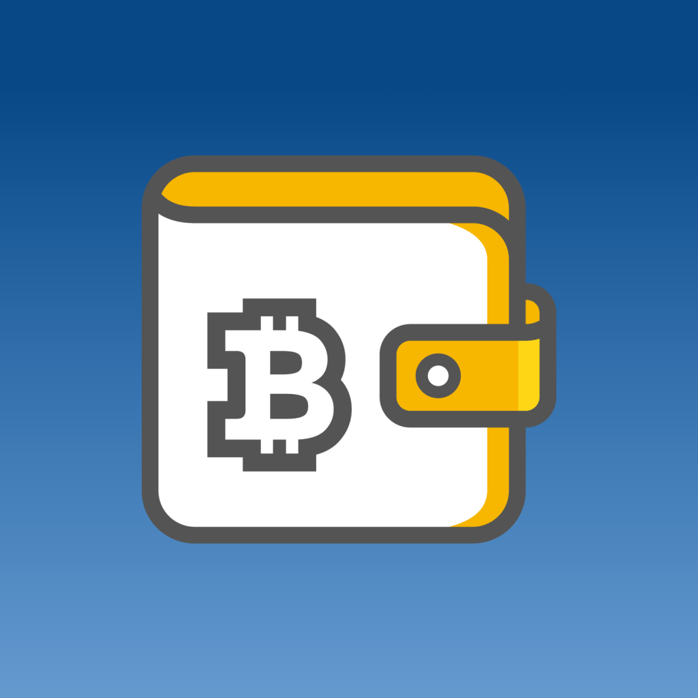
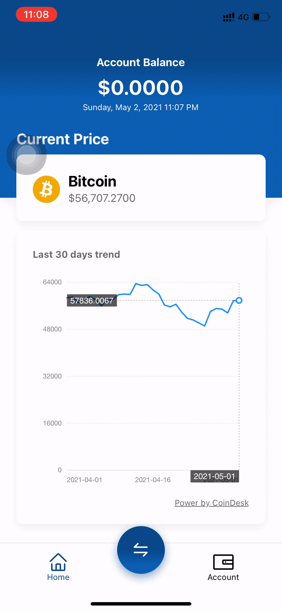
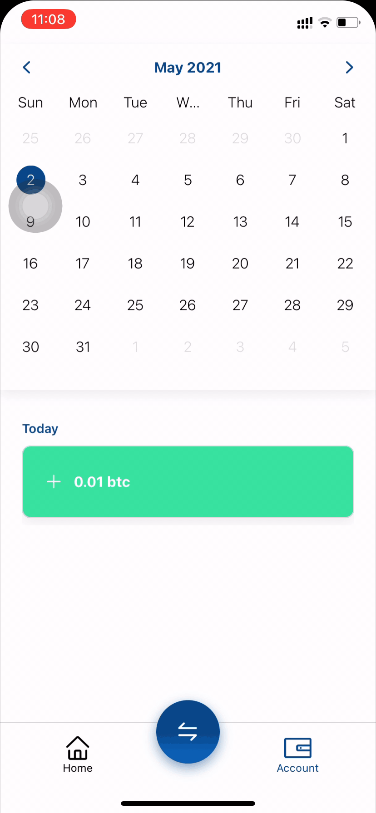
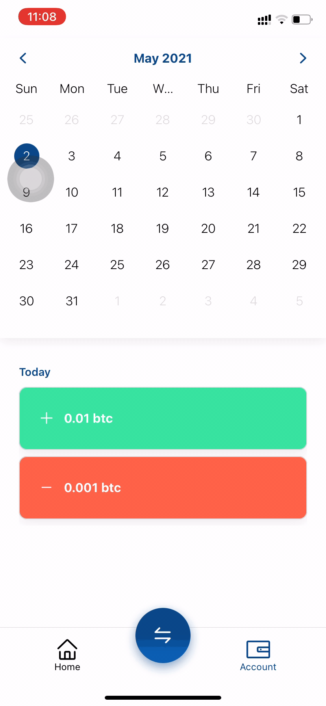

# Bitcoin Wallet



## Seedly React Native Assignment

This project is build by using expo cli. It make use of [CoinDesk API](https://www.coindesk.com/coindesk-api) for current price and last 30 days trend. Theme color palette is generate by [Coolors](https://coolors.co/). Spash screen and App Icon is design from [Figma](https://www.figma.com/file/lkyWcrWkryEvFZ8fjMPouW/Bitcoin-Wallet?node-id=0%3A1). Icon is from [BitcoinWiki](https://en.bitcoinwiki.org/wiki/Bitcoin_wallet).

## Features

- Display current available balance
- Display current Bitcoin price
- Display last 30 days Bitcoin trend in line chart
- Auto refetch data every 1 minute
- Able to add, edit, remove Bitcoin transaction history
- Able to browse thru calendar to check previous transaction history
- Store transaction history in local storage

<div style="display:flex;">
    <figure>
        
        <figcaption style="font-size:12px;margin:10px;text-align:center;">Display current price</figcaption>
    </figure>
    <figure>
        
        <figcaption style="font-size:12px;margin:10px;text-align:center;">Add transaction</figcaption>
    </figure>
    <figure>
        
        <figcaption style="font-size:12px;margin:10px;text-align:center;">Update transaction</figcaption>
    </figure>
</div>

## Tech

Bitcoin wallet uses a number of dependencies to work:

- [[React Navigation](https://reactnavigation.org/)] - Navigation for your React Native apps
- [[React Native Calendars](https://github.com/wix/react-native-calendars)] - Calendars to check each day transaction
- [[moment](https://github.com/moment/moment)] - Dates formatting.
- [[React Native modal datetime picker](https://github.com/mmazzarolo/react-native-modal-datetime-picker)] - Datetime picker in modal view
- [[Redux](https://react-redux.js.org/)] - Global state, local storage
- [[React Query](https://react-query.tanstack.com/)] - Fetching data, and also refetching data every 1 minute
- [[f2 Chart](https://f2.antv.vision/en)] - Data visualization in line chart

## Demo

Requires Expo Go [android](https://play.google.com/store/apps/details?id=host.exp.exponent&hl=en_SG&gl=US) / [ios](https://apps.apple.com/us/app/expo-go/id982107779) to run.

[Demo link](https://expo.io/@dennisloh95/projects/bitcoin-wallet)

## Installation

Requires [Node.js](https://nodejs.org/) to run.

Install the dependencies and devDependencies and start the server.

```sh
cd bitcoin-wallet
yarn install
yarn start
```
